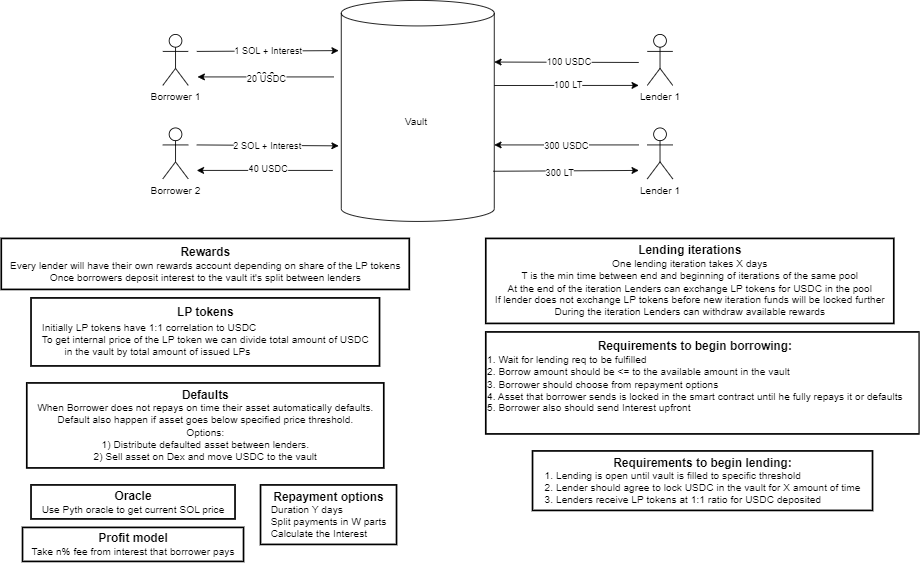
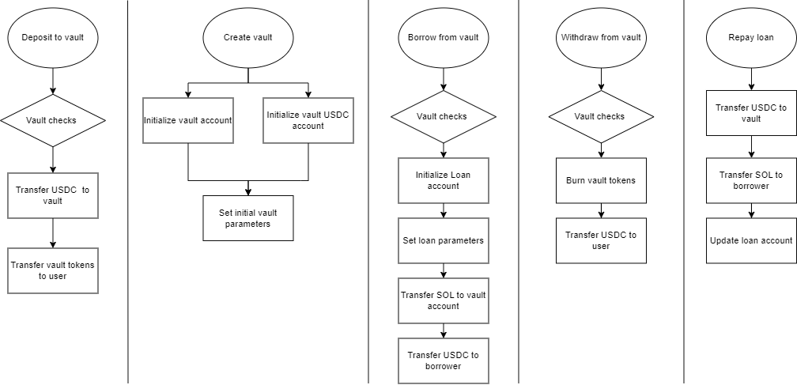

# solana-hackathon2023

## Abstract
Description of the project

## Team Members
- [Vadzim Mahilny](https://github.com/MIDAV0)
- [Karl Timmins](https://github.com/Karlitoyo)

## High-level overview of the project

## Project implementation
Tech stack:
- [Anchor](https://project-serum.github.io/anchor/getting-started/introduction.html) - Solana smart contract framework
- [React](https://reactjs.org/) - Front end framework
- [Solana](https://solana.com/) - Blockchain

## Wireframes
Landing Page:
- 
- 
- 
- 
- 

## Instruction pipeline

## How to run

`anchor build` - build smart contracts

`anchor test` - test contract

`anchor deploy` -  deploy

`yarn install`

Front end is in `frontend` folder (react-app).
